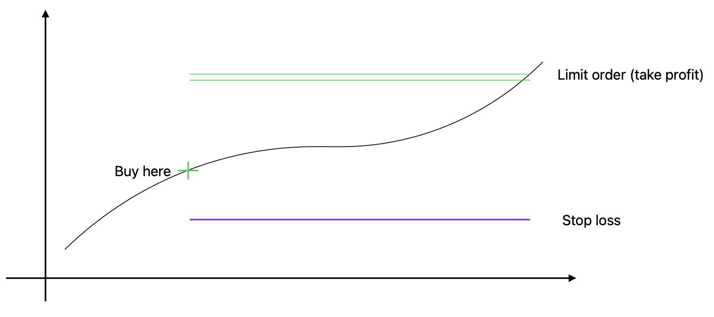
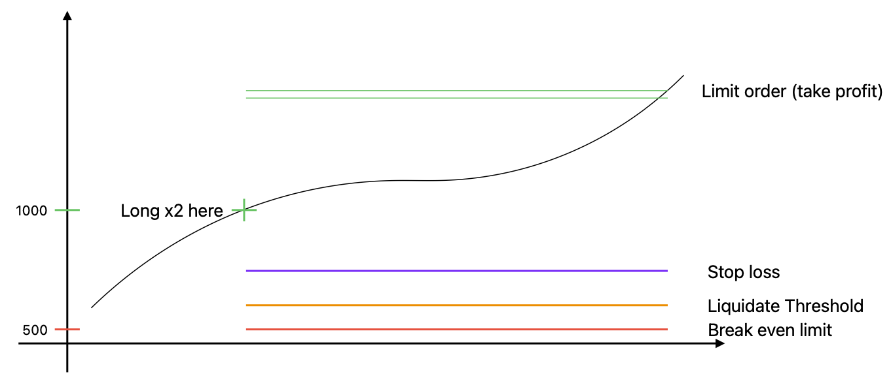

# Uniswap Max contracts

[Chainlink Spring 2023 Hackathon submission](https://devpost.com/software/uniswap-max)


## Requirements

Please install the following:

-   [Git](https://git-scm.com/book/en/v2/Getting-Started-Installing-Git)
    -   You'll know you've done it right if you can run `git --version`
-   [Foundry / Foundryup](https://github.com/gakonst/foundry)
    -   This will install `forge`, `cast`, and `anvil`
    -   You can test you've installed them right by running `forge --version` and get an output like: `forge 0.2.0 (f016135 2022-07-04T00:15:02.930499Z)`
    -   To get the latest of each, just run `foundryup`

And you probably already have `make` installed... but if not [try looking here.](https://askubuntu.com/questions/161104/how-do-i-install-make)

## Setup

You'll need to add the following variables to a `.env` file:

-   `ETH_RPC_URL`: A URL to connect fork the mainnet.
-   `PRIVATE_KEY`: A private key from your wallet. You can get a private key from a new [Metamask](https://metamask.io/) account
-   Optional `ETHERSCAN_API_KEY`: If you want to verify on etherscan

## Quickstart

```sh
git https://github.com/Los-Byzantinos/Uniswap-Max
cd Uniswap-Max
```

Fill **ETH_RPC_URL** in `.env`

```sh
make test fork
```

## Local Testing

```
make anvil
```

Open an other terminal and :

```
make deploy-anvil
```

# Resources

-   [Chainlink Documentation](https://docs.chain.link/)
-   [Foundry Documentation](https://book.getfoundry.sh/)

## ---------------------------------------------

# Uniswap Max White paper

Live demo on Ethereum mainnet fork : [uniswap-max.vercel.app](https://uniswap-max.vercel.app/)

Code base contracts/front : [github.com/orgs/Los-Byzantinos](https://github.com/orgs/Los-Byzantinos/repositories)

# Abstract

When building a decentralized exchange, the hardest part is attracting liquidity. Every cutting-edge, little-known DEX has liquidity problems that put them in a vicious cycle: No users → No liquidity → No transaction volume → No reputation → So no liquidity → So no users.

DeFi's composability makes it possible to benefit from the liquidity of other protocols, so why start from scratch? Removing the liquidity problem will make these types of DEXes attractive from the start and eventually attract users.

Uniswap Max aims to solve this problem. By leveraging Chainlink price feeds, we supercharged Uniswap V3 by implementing high liquidity modern trading tools on top of it:

- Limit Order
- Stop Loss
- Margin trading
    - Long / Short
    - Leverage

### What’s new for traders with Uniswap Max ?

Our protocol architecture allows margin trading on any asset that has a XXX/ETH Chainlink price feed.

For example, someone can open a 3x short position on WBTC/MATIC with a stop loss and a limit order (take profit).

The trader can basically create the margin product of his dreams. This makes Uniswap Max quite unique and attractive when someone wants to trade on atypical pairs.

# Tech Stack

## Smart Contracts

We used the [foundry](https://github.com/smartcontractkit/foundry-starter-kit) framework and deploying on an Uniswap V3 compatible chain.

| Contract name | Description | Fork/Inspiration/Library |
| --- | --- | --- |
| Positions.sol | Positions recorder/main contract | OZ https://github.com/OpenZeppelin/openzeppelin-contracts/blob/master/contracts/token/ERC721/ERC721.sol |
| Market.sol | Global protocol interface | - |
| LiquidityPool.sol | Liquidity pool for leverage and short position one liquidity pool for each token | Solmate https://github.com/transmissions11/solmate/blob/main/src/mixins/ERC4626.sol |
| LiquidityPoolFactory.sol | Interface the create LiquidityPoolXXX | - |
| PriceFeed.sol | The price feed | https://docs.chain.link/data-feeds/#price-feeds |
| UniswapV3Helper.sol | Helper for managing liquidity and swap on Uniswap | https://github.com/stakewithus/defi-by-example/tree/main/uni-v3/contracts |


### Positions

The `Positions.sol` contract is the main contract and is owned by the `Market.sol` contract. The user is able to personalize his position with stop loss, limit order and/or margin trading (short, leverage). For example, this composability allows to create a leveraged short with a take profit and a stop loss.

The user receive an NFT representing his position.

### Liquidations

For a leveraged position, we need to be sure that the position will be liquidated before the breakeven limit, so we decided to rely on a fixed monetary incentive, which is taken from the trader when the position is opened, and then given to the liquidator when the position is liquidated.

For each margin position there will be a spread between the break-even price and the liquidation price. Through this really simple mechanism, liquidators are incentivized to liquidate positions quickly in order to earn the liquidation reward first, helping the protocol to remain solvent.

This reward is taken from the trader's initial deposit and returned if the liquidation doesn't occur. Of course, the reward should be adjusted depending on the network gas fees.

A position is liquidable when :

- This Limit Order is reached
- The Stop Loss is reached
- The liquidation price is crossed (acts like an automatic stop loss. Only for margin trading positions)


### Liquidity providers

`LiquidityPoolXXX.sol` will produce a yield for liquidity providers. 

The yield will come from margin trading fees : 

- Opening a position costs ****$\text{assets borrowed} \times 0.2%$%
- Borrowing fee taken every hours :  $\frac{\text{assets borrowed}}{\text{total assets in pool}} \times 0.01%$% (fixed at the position opening)

NB : there are no fees for classic positions.

### Market

The `Market.sol` contract will be the only entry point for all entities:

- The **Trader** : will be able to **open**, **close** and **edit** his positions.
- The **Liquidity provider** : will be allowed to provide liquidity.
- The *Liquidator*: will be able to liquidate the trader's position for a reward.
- The **Admin** : will be able to create a new pool

## Frontend

- [NextJS](https://nextjs.org/)
- [Vercel](https://vercel.com/) for hosting
- [RainbowKit](https://www.rainbowkit.com/) to handle the browser wallet
- [Trading](https://www.tradingview.com/tradingview-for-the-web/) view API to visualize graphics

# How it works

By leveraging the Chainlink price feed, we will supercharge Uniswap V3 by implementing high liquidity modern trading tools on top of the protocol:

- Limit Order
- Stop Loss
- Margin trading
    - Long / Short
    - Leverage

### Limit Order

Create a liquidity position that can be liquidated when the position crosses from one asset to another.

### Stop Loss

Sell the market when the stop price is triggered.

### Market Order (Classic Swap)

Redirect to the native Uniswap interface.

### Leveraged Position (Long/Short)

In order to offer margin trading, we need to create pools that allow anyone to provide liquidity. Then the liquidity providers earn an APY from the fees collected from the traders.

The protocol manages liquidation to stay solvent and provide stable income for the liquidity providers.


The user open a long position by sending the base token and open a short position by sending the quote token. (see figure below)

When longing, we need to borrow the quote token from liquidityPool

When shorting, we need to borrow the base token from liquidityPool

# The oracle

We leveraged the Chainlink price feed to effectively monitor position collateralization. To ensure seamless trading on Uniswap Max, we establish our own reliable price feed for custom pairs by using XXX/ETH chainlink price feed. This approach mandates the existence of a corresponding Chainlink price feed (XXX/ETH) for both tokens within the trading pair.

By integrating the Chainlink price feed, we gain access to accurate and up-to-date market prices, which are crucial for determining the collateralization status of positions.

However, since the Oracle uses a market average from multiple data sources, the value returned may be decorellated from the Uniswap price, resulting in a potential bad debt creation.

Here are some points to mitigate this problem:

- Uniswap is the most liquid DEX. We can expect the price to be close to the market average.
- For margin trading, we will focus on high liquidity asset in the first place to improve liquidations.
- Since the liquidation reward is a fixed amount, the liquidator will be incentivized to close the position as soon as possible.
- If it's not enough, unfortunately someone will have to take the loss and it will be the liquidity pool.

# Position examples

Note that it’s not mandatory to configure a **stop loss** or a **limit order**. Traders can customize their trade as they wish. Some example below:

## The classic buy position



## Leveraged x2 long



## Leveraged x2 short


# **About the project**

## Challenges we ran into

We think the most difficult part was to build the interface with Uniswap. DeFi's composability is a strength, but it's also very difficult to implement. Part of uniswap's documentation was wrong, which cost us a lot of time.

## Accomplishments that we're proud of

We think that this kind of project, which combines DeFi and composability with other protocols, are the most difficult to build. Moreover, this project deal with: tokens (ERC20), liquidity pools / vaults (ERC4626), NFTs (ERC721), Chainlink price feeds and Uniswap interfacing. We learnt a lot!

To have reached the end is already a great achievement.

# Things to change

## Features to add

- Be able to fully edit a position
- Improve the front-end interface

## Already known bugs

- Pools are flash loanable to reduce the borrowing fee
    - compute fees using a snapshot of the past
- The liquidation price is not adjusted when fees are taken
- For L2 deployments we will need to re-write de oracle interface
- Rounding error on the hourly fee for small positions
- We need to study more the protocol behavior for low liquidity pairs

# References

### Helper

https://www.openzeppelin.com/contracts

https://github.com/transmissions11/solmate/blob/main/src/mixins/ERC4626.sol

https://www.rainbowkit.com/

### Uniswap

https://uniswap.org/whitepaper-v3.pdf

https://docs.uniswap.org/contracts/v3/guides/providing-liquidity/the-full-contract

https://docs.uniswap.org/contracts/v3/guides/swaps/single-swaps