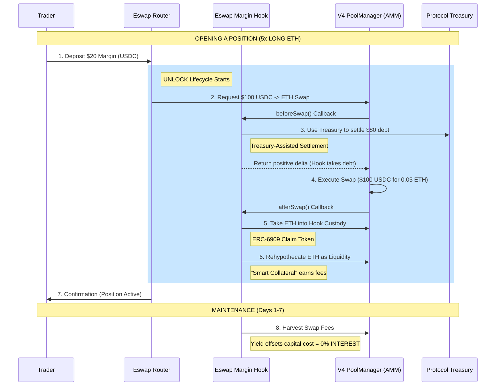

# ESWAP V4: Visual Trade Flow

This diagram illustrates how a trader opens a **5x Leveraged Position** at **0% Interest** using the ESWAP V4 "End-Game" architecture.

### Simple Breakdown:
1. **The Down Payment:** You provide **$20**.
2. **The Boost:** The Hook uses the **Protocol Treasury** to "borrow" the other **$80** from the AMM reserves.
3. **The Buy:** One big **$100** swap happens inside Uniswap V4.
4. **The Safe-Box:** The ETH you bought is held by the **Hook** (to keep the loan safe).
5. **The Magic:** While you wait, the Hook puts your ETH back into the pool to **earn fees**.
6. **Result:** Those fees pay for the $80 boost. You pay **$0 in interest** for days!
